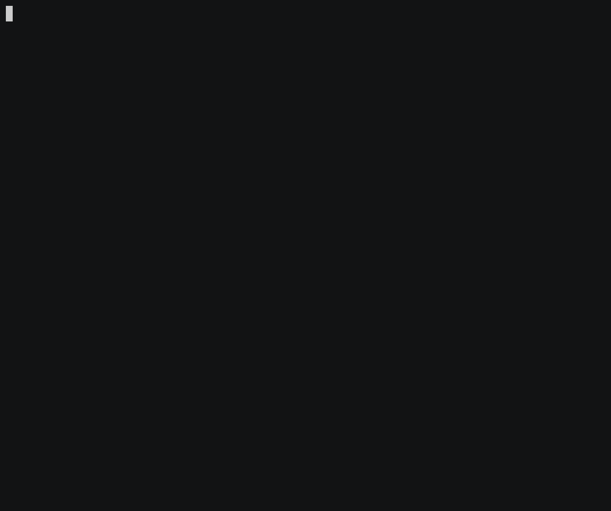

# til-rb

A work-in-progress tool to maintain a TIL repo.

Inspiration: https://github.com/jbranchaud/til

See it in action below:



## Installation

### Step 1: Install the gem

```
gem install til-rb
```

You will also need `fzf` to run `til`, it's available on homebrew, so unless you already installed it, you'll have to run

```
brew install fzf
```

_fzf is technically not a hard requirement, we really could have a slightly different workflow if it's not available.
Given that I currently am the only user, there's no need to change this at the moment, but if you'd like to use this
gem without `fzf`, let me know and I'll happily work on it!_

### Step 2: Create a GitHub repo

You need a GitHub repo to store your TILs. The gem has pretty strict expectations about the format of the README.md
file, so I recommend forking [this repo](https://github.com/pjambet/til-template), or just copying the content to a
fresh new repo.

Note: The format expectations mentioned above are the following:

- A "categories" section as defined by a leading markdown separator `---`, followed by a blank line, the `###
  Categories` title, and a list of all the categories.
- A links section as defined by a leading markdown separator `---`, followed by a blank line and a series of markdown
  titles for each categories present in the previous section.

### Step 3: Add the environment variables

Add the following variables to your environment:

- `TIL_RB_GITHUB_TOKEN`: The only required scope is `public_repo` if your TIL repo is public and `repo` if it is private. You can
  create a token [in the GitHub
  settings](https://github.com/settings/tokens/new?scopes=public_repo&description=Token%20for%20til-rb)
- `TIL_RB_GITHUB_REPO`: The repo name, e.g. `pjambet/til`

You might want to add those to either your `.bashrc` or `.zshrc` but please be careful in case you share those publicly
as the token is private and *must not* be shared publicly.

Note: An earlier version of this gem used different names, `GH_TOKEN` & `GH_REPO`, it still works, but is not the
recommended approach anymore, see #2.

### Step 4:

Run `til` from the command line

## Future improvements

- An `init` command that will create a repo for you
- A `configure` command that will store the token and the repo name in a file in `~/.config/til/config` or `~/.til`

## Known issues

The current version (0.0.5) deletes the temporary file before attempting to create the new commit, so if anything goes
wrong there, the content of the file will be lost.
This will be fixed soon, by only deleting the temporary file after the commit was created, but please keep that in mind
if you typed a long TIL and definitely don't want to lose its content.
